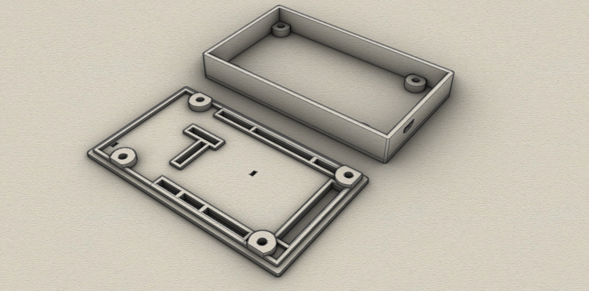
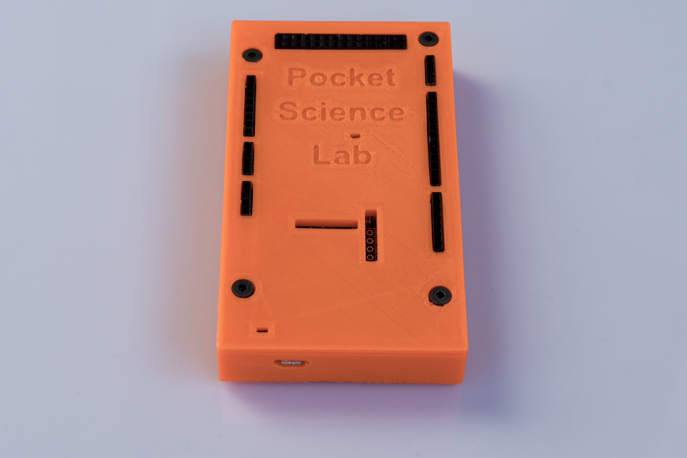

# Pocket Science Lab enclosure
3D-printable case for Pocket Science Lab (PSLab) (STL File, created with Rhino 6) 

## 3D Case

The enclosure consists of 2 parts which are screwed together. 

Requirements:
* 3D printer 
* Filament of your choice
* 4 x 12mm M3 screws

## View

